# Admin GUI 

Admin GUI is lightweight graphic user interface to support general and frequent scenarios for administration of CleverBus solutions such as observation and search information about processes in case of problems.

The default page without credentials allows you to view the current version:

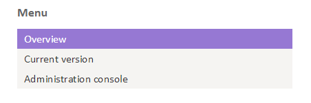

To work with the admin console must log by username and password with appropriate authorization.

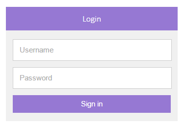

After logging in the user sees the signpost and appropriate actions, which may be carried out on the basis of the authorization.

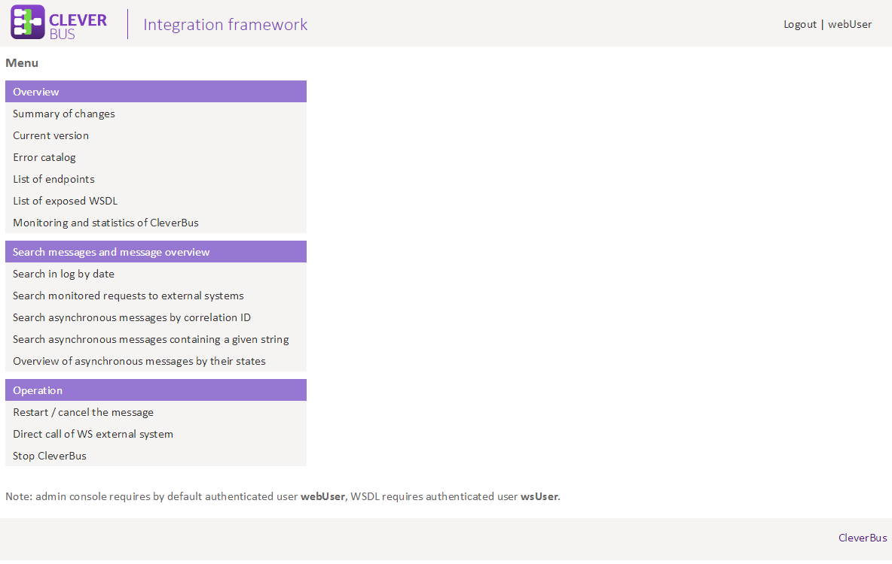

## Ping service (for test)

**Link:** */esb/http/ping* (not accessible from the menu)

Service to checking if the CleverBus platform respectively admin GUI is still active, whether the application is running.

## List of changes

**Link:** summary of changes (*/esb/web/admin/changes*)

Displaying a list of changes that have occurred primarily on input interfaces and services that provides CleverBus.

## Current version

**Link:** current version (*/esb/http/version*)

Displaying a current version of Cleverbus which shows unique version from SCM. Version is in format 0.1-SNAPSHOT.r1285 (Aug 12, 2013 4:19:13 AM) where 0.1-SNAPSHOT is main version, r1285 is number of revision from version control system and the date in brackets is time where package WAR was created.

## Error catalog

**Link:** error catalog (*/esb/web/admin/errorCatalog*)

Displaying a catalog of error codes that shows all error codes which are defined by developers during creating processes. This allows you to trace a specific meaning return error code that identifies CleverBus within each execution of service.

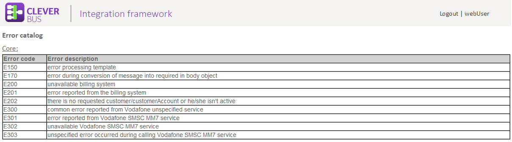

## Endpoints overview

    Since version 0.4

**Link:** */esb/web/admin/endpoints*

Overview of inbound camel URI endpoints

It is necessary to properly configure configuration parameter *endpoints.includePattern* which defines pattern for the URIs which are traced. See more information in chapter [configuration](Configuration).

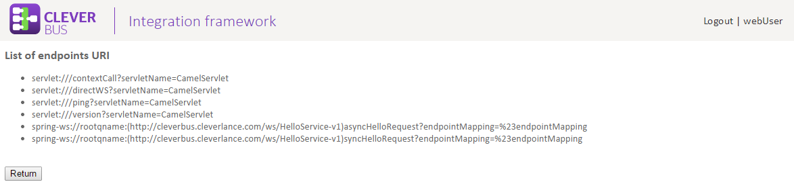

## Exposed WSDLs overview

    Since version 0.4

**Link:** */esb/web/admin/wsdl*

Overview of exposed WSDL contracts.

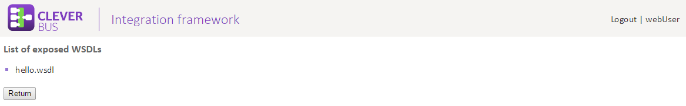

## Search in log by date

**Link:** Searching any information in the log platform CleverBus (*/esb/log*)

Searching for information in the log CleverBus platform. Based upon input categorization, parameters and filters can be searched in the log that is in accordance with the parameters in which CleverBus platform generates logs.

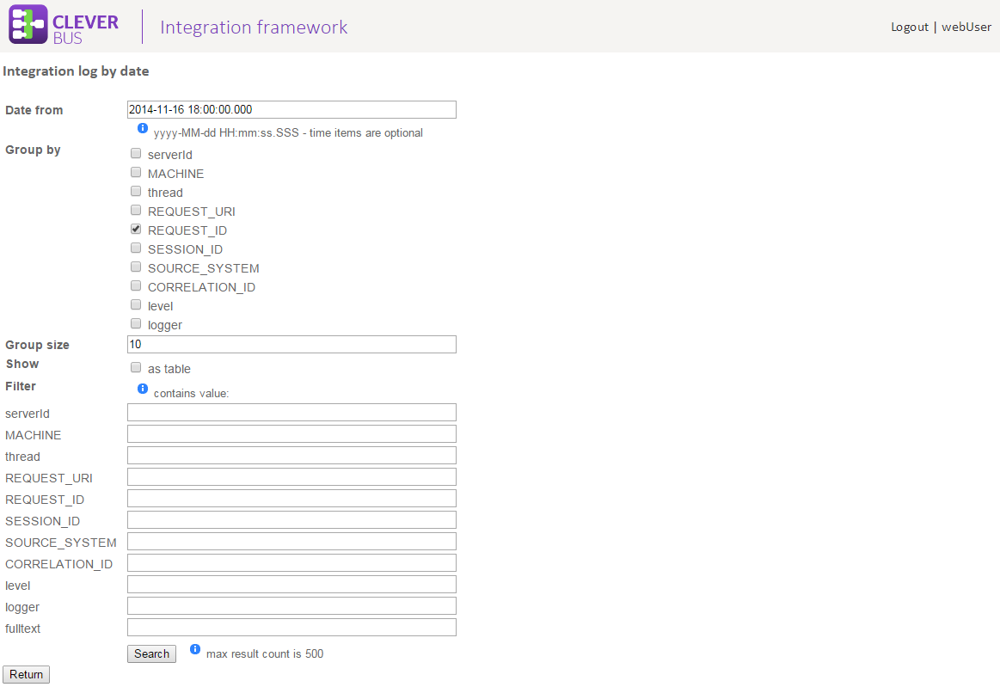

The following funcion is available since version 0.4

Important information such as requests and responses for CleverBus platform or requests and responses sent into external systems or errors are highlighted. If a message is asynchronous, each record in log contains also identification of external system (e.g. CRM) and correlation ID (sceptra tenens) such as stated in picture below. These highlighted parts are concurrently clickable links by which can go to detail of message. Next highlighted parts are for example request and response by which you can show modal window with request and response that are reformatted (if this is SOAP message).

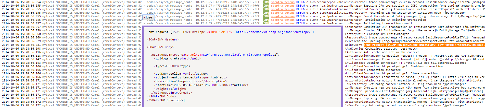

## Finding monitored requests to external systems

    Since version 0.4

**Link:** Searching by parameters in all monitored (defined by configuration) requests and responses sent into external systems (*/esb/web/admin/reqresp/search*).

According defined filter where parameters *Date from* and *Date to* are required, can search records of monitored requests and responses, which were sent into external systems. Each records contains also state and potential error if is occurred. If the request was sent within asynchronous process the record also contains direct link to detail of asynchronous message. Integration platform but for performance reasons returns only up to 50 entries which are suitable by defined filter.

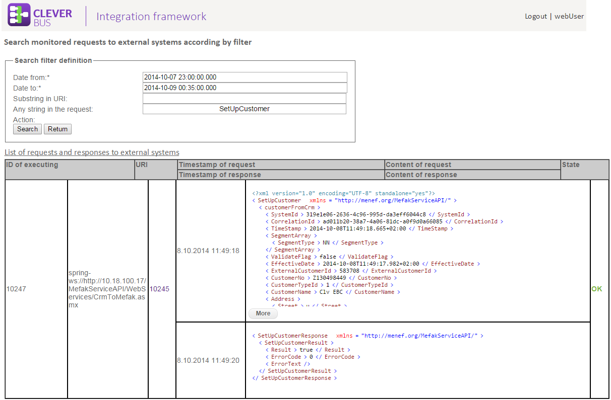

## Finding asynchronous message by correlation ID

**Link:** Searching asynchronous message by correlation ID (unique ID of inbound message) and identification of external system (*/esb/web/admin/messages/searchForm*)

Showing **asynchronous** message in CleverBus platform which according incoming request identified by unique correlation ID and identifier of external system which sent this request. Result is detail of prospected message.

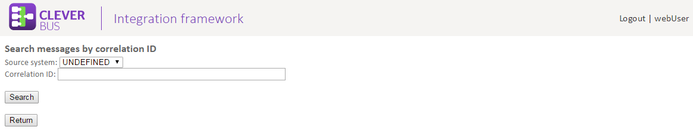

## Finding asynchronous message which contain given string

**Link:** Searching asynchronous message which contain given string in body of message (*/esb/web/admin/messages/messagesByContent*)

Displaying all **asynchronous** messages in CleverBus integration framework which contain in inbound request body given string.

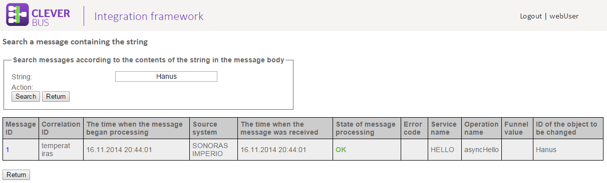

Use clickable ID of message you can go to detail of asynchronous message.

Detail of message contains all necessary information which are stored by CleverBus integration platform and also contains the list of external calls and their statuses which identifies concrete place in process with potential error. If the message is not properly processed the state is FAILED with error code and description. You can show detail information about error by clickable error code.

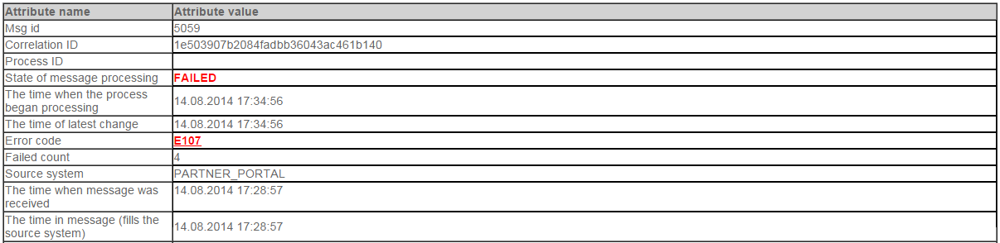

Each request and response into external system could be logged (by configuration, see [Request/response tracking](Request-response-tracking)) and these records are showed below detail of message. 

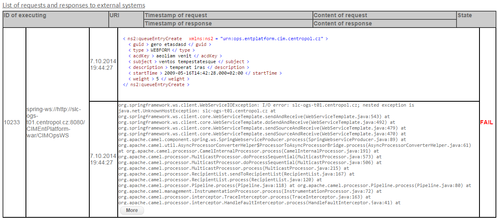

## Finding detail of message

**Link:** Searching the message by correlation ID (*/esb/web/messages/searchForm*)

Each asynchronous message is strictly identified by external system that sent this message and correlation ID. Correlation ID is unique identifier for each external system. With these two parameters can search detail of message. If message exists CleverBus shows detail of it with all information which are joined with this message - inbound request that will be processed, state of processing and list of potential errors and so on. If detail of message does not contain required information you can browse integration log by "Integration log" button (above the detail of message). This button shows in single page all grouped logged records for this message (log viewer).

Some records are highlighted (only informative):

-   red parts are errors (exceptions)
-   orange parts are executing of calls (request, response) into external systems

Notice: records displayed in this single page are searched only by correlation ID. Some records but don't contain correlation ID and thanks to it these records will not be displayed in this page.

## Restart FAILED messages

**Link:** Admin - Message operation (*/esb/web/admin/messageOperations*)

Often happens that asynchronous messages fails (is in FAILED state) for error reason or general for unavailable external system. In this cases it is possible restart the message. In during processing of asynchronous message there are "through points" (external calls) defined by developers. It is our customized implementation of the idempotent component and it is used to filter out duplicate messages. This uses an expression to calculate a unique message ID string (as subpart of process) for a given message exchange; this ID can then be looked up in the idempotent repository (external\_call table) to see if it has been before; if it has the message is consumed; if its not then the message is processed and the ID is added to the repository. Thanks to that each process can be divided into independent parts which have own status (OK, FAILED). During next iteration the message can be processed from the through point in which message was not processed correctly (with error). You can choose whether the message will be processed from scratch or from the point where message processing failed.

## Cancel next processing of message - CANCEL

**Link:** Admin - Message operation (*/esb/web/admin/messageOperations*)

Administrator can manually cancel next iteration of processing the message. After that the message will be in final state *CANCEL.*

## Steps to solve messages with errors

Recommendation steps:

1.  search detail of message and check status, error and reason description
2.  if information is insufficient can search detail integration log by button
3.  each message contains message (body) of request that could be useful for reproducing
4.  the largest percentage of errors is due to communication with external system - wrong format of data, unexpected value, error in external system and so on - for this reason it is necessary to search request into external system sent by integration platform

## Direct call to external system (only for WS communication)

Sometimes it is necessary to call external system directly and send into it specific request, e.g. repair data during standard processing.

This function is mainly for production environment, because there are limited options to call external system and often it can be only through an integration platform for security reasons call.

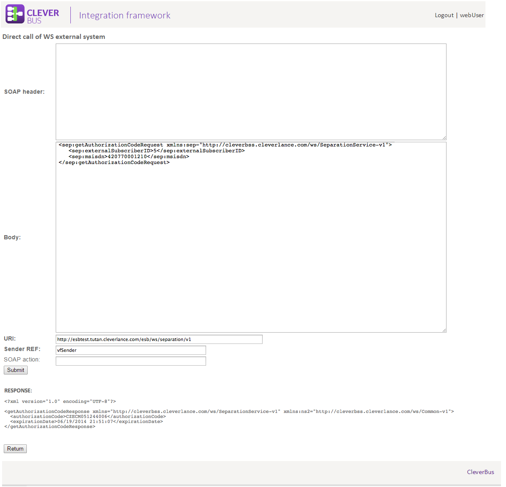

## Shutdown CleverBus

    Since version 0.4

Stopping CleverBus is useful function for correctly shutdown when integration platform starts to reject new asynchronous messages. Current processing messages are processed (message in status *PROCESSING* and *WAITING\_FOR\_RES*)

This function correctly stop CleverBus for example for upgrade reason. If CleverBus is configured as clustered environment we can upgrade each node separately without stop whole solution (under certain conditions).

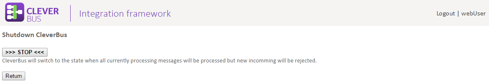

After switch to shutdown process can watch the number of current processing messages.

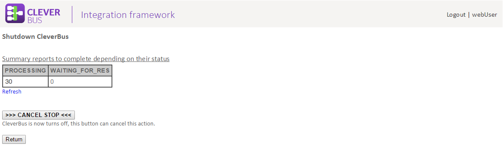
