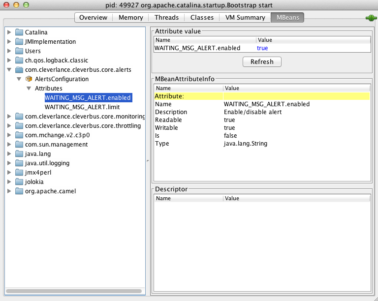

# CleverBus: Alerts

Since version 0.4

Alerts REST API since version 2.2.1

## Description

Alerts define metrics for watching database data and if any metric exceeds its limit then alert is activated and further operation can be executed. Alert metrics are also exposed via REST API, allowing the integration of CleverBus alerts with 3rd party monitoring tools. An integration with Zabbix monitoring tool is described here: [Zabbix integration](Zabbix-integration)

Metrics are configured with the SQL query that retrieves the count of selected items and with the optional action threshold.

Examples of alerts (with follow-up operations):

-   when count of failed messages for last 10 minutes exceeds 5 then send email to administrators
-   when count of messages which wait for response from external system for more then 5 minutes exceeds 10 then send email to administrators

Alerts checking is scheduled operation that is determined by alerts.repeatTime [configuration](Configuration) parameter - checking is executed every 5 minutes by default.

## Alerts configuration

There are the following configuration possibilites:

-   property files (default option)
-   JMX

### Configuration using property files

There the following property files (with increasing priority):

-   *alertsCore.cfg* (in sc-core module)
-   *alerts.cfg* (in sc-web-admin module)
-   *alerts0.cfg* (in specific project module)

 
The configuration in the higher-priority files overrides the previous definitions.
 
Property file configuration format and example:

``` 
###############################################################################
#  Alerts core configuration file.
#
#   There the following property names:
#   - alerts.N.id: unique alert identification (if not defined then order number (=N) is used instead)
#   - alerts.N.limit: limit that must be exceeded to activate alert
#   - alerts.N.sql: SQL query that returns count of items for comparison with limit value
#   - [alerts.N.enabled]: if specified alert is enabled or disabled; enabled is by default
#   - [alerts.N.mail.subject]: notification (email, sms) subject; can be used Java Formatter placeholders (%s = alert ID)
#   - [alerts.N.mail.body]: notification (email, sms) body; can be used Java Formatter placeholders (%d = actual count, %d = limit)
#   - [alerts.N.notificationType]: type of notification:
#                                  NONE - there will be no notification when the threshold is reached
#                                  EMAIL - notification will be always send by email
#                                  EMAIL_EXCEEDED_LIMIT - notification will be send only when the threshold is crossed (either up or down) (default value)
#
#
###############################################################################

# checks if there is any waiting message that exceeds time limit for timeout
alerts.900.id=WAITING_MSG_ALERT
alerts.900.limit=0
alerts.900.sql=SELECT COUNT(*) FROM message WHERE state = 'WAITING_FOR_RES' AND last_update_timestamp < (current_timestamp - interval '3600 seconds')
alerts.900.notificationType=EMAIL
```

Alerts from core module start from 900, project-specific alerts start from 0. This order number is only for better description, doesn't have influence to behaviour.

SQL queries must be defined for specific database that is use.

### Configuration using JMX

JMX configuration allows change alert limits and enable/disable selected alerts.



## Spring configuration

The alert system is initialized in the following sequence:

-   initialization of alerts from property files
-   initialization of service for executing SQL queries and checking limits
-   initialization of default listener that sends email to administrators for each alert that will be activated

*[sp\_camel\_services.xml](Maven-and-Spring)*:

``` xml
<bean id="alertsConfiguration" class="org.cleverbus.core.alerts.AlertsPropertiesConfiguration">
	<constructor-arg ref="confProperties"/>
</bean>
<bean id="alertsCheckingService" class="org.cleverbus.core.alerts.AlertsCheckingServiceDbImpl"/>
<bean class="org.cleverbus.core.alerts.EmailAlertListenerSupport"/>
```

*spring-ws-servlet.xml* - adding property files:

``` xml
<bean id="confProperties" class="org.springframework.beans.factory.config.PropertiesFactoryBean">
	<property name="ignoreResourceNotFound" value="true"/>
	<property name="locations">
            <list>
                <value>classpath:applicationCore.cfg</value>
                ...
                <value>classpath:alertsCore.cfg</value>
                <value>classpath:alerts.cfg</value>
                <value>classpath:alerts0.cfg</value>
    	</list>
	</property>
</bean>
```

## Reaction to alerts

There are listeners *org.cleverbus.spi.alerts.AlertListener* which are called when specified alert is activated. 

There is default *org.cleverbus.core.alerts.EmailAlertListenerSupport* implementation that  sends email notifications to admin emails.

If you want to implement more actions and you can implement *AlertListener *or extends default implementation *EmailAlertListenerSupport.*

## REST API

Alerts definition and values are by default exposed via REST API. 

Definition of all configured alerts in JSON format is available at the following URL:

```
https://<cleverbus server>/esb/rpc/v1/alert/getAll
```

The computed value of the specific alert item can be retrieved from this URL:

```
https://<cleverbus server>/esb/rpc/v1/alert/alertCalculation/<alert ID>
```

