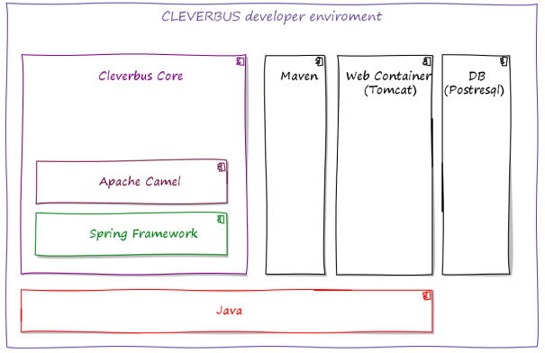

# Architecture

## Main third party components

CleverBus extends Apache Camel and therefore [base architecture](http://camel.apache.org/architecture.html) came up from Apache Camel.

-   [Spring Framework](http://projects.spring.io/spring-framework/)
-   [Spring Security](http://projects.spring.io/spring-security/) solves security issues
-   [Spring Web Services](http://projects.spring.io/spring-ws/) is main component for web services communication
-   [Hibernate](http://hibernate.org/) for persistence implementation
-   [PostgreSQL](http://www.postgresql.org/) database
-   [Apache Tomcat](http://tomcat.apache.org) application server

CleverBus is technologically neutral to operation system, application server and database. PostgreSQL or Tomcat is one possible choice only.

