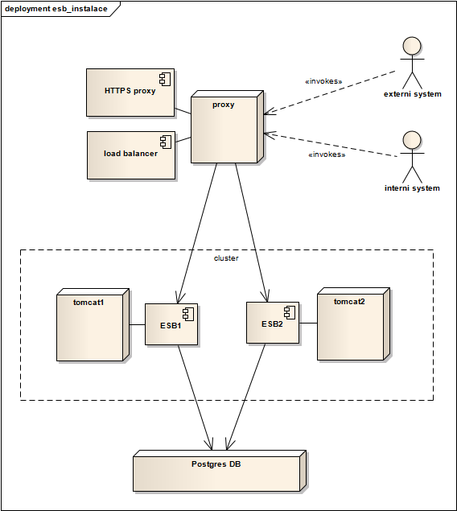
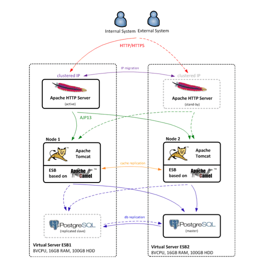

# Centropol Telecom application stack

## Description

CleverBus platform is light-weight application that can be installed on arbitrary web Java application server.

General requirements:

-   application web server (Apache Tomcat 7 and higher is best solution)
-   SQL database (PostgreSQL is recommened, but there is no dependency to specific database)
-   Java version 6 and higher
-   at least 256MB heap memory (JVM parameters: *-Xms192m -Xmx256m*)
-   at least 256MB permgen memory (JVM parameters: -*XX:MaxPermSize=256m*)
-   at least 5GB free space on filesystem for storing application logs

## Centropol Telecom configuration

[Centropol Telecom](http://www.centropoltelecom.cz) uses the following technology stack:

-   CentOS 6.4 64bit
-   Apache Tomcat 7
-   PostgreSQL 9 (open source version)
-   Apache HTTP server - mod\_proxy\_balancer is used for load balancing (round robbin algorhitm).
-   HTTP proxy terminates SSL communication with external systems
    

