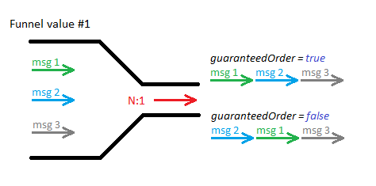

# msg-funnel

    Since version 0.2

## Description

This component is for asynchronous messages only.

Component "funnel" is for filtering concurrent messages at specific integration point. This filtering ensures that only one message at one moment will be processed, even in garanteed order (optional choice).

Usage example: if external system can process only one request for specific customer then you need to filter outgoing requests to this system.

Msg-funnel component uses *funnel value* for finding out if two or more concurrent messages impact identical object. Funnel value can be anything, e.g. customer ID, subscriber mobile number, custom string etc.

Funnel value is taken from *AsynchConstants.FUNNEL\_VALUE\_HEADER* header value - can be set explicitly or use *org.cleverbus.api.asynch.AsynchRouteBuilder* class for simpler route implementation. Example of *AsynchRouteBuilder* usage is shown on [Guaranteed message processing order](../Asynchronous-messages/Guaranteed-message-processing-order) page.

If there is processing message and this component detects different concurrent message(s) with the same funnel value that is also processed (message in states *PROCESSING*, *WAITING* and *WAITING\_FOR\_RES*) then processing of current message is postponed (changed state to *POSTPONED*). This message will stay in this state for certain moment ([configuration parameter *asynch.postponedInterval*](../../User-guide/Configuration)) and then will try it to process again.

Component is working in two modes (according to the parameter *guaranteedOrder*):

-   **classic funnel** - component checks concurrent messages and ensures that only one message at one time will be processed. This is default mode, parameter *guaranteedOrder *is *false.*
-   **guaranteed funnel** - if parameter *guaranteedOrder *is *true*, then component garantees processing order of message (by *msgTimestamp*) on top of that. Component in this mode takes into consideration messages in other states (*PARTLY\_FAILED*, *FAILED* and *POSTPONED*) because it's necessary to guarantee processing order among all messages with same funnel value.




### URI format

```
msg-funnel:default[?options]
```

## Options

| Parameter            | Type | Default | Description |
| -------------------- | ---- | ------- | ----------- |
| *idleInterval*       | number | 600 | Interval in seconds how long can be message be processing (= be in state *PROCESSING*). In other words during this interval will be message considered as being processed.<p>This is for cases when processing message can be locked during processing, forexample in communication with external system that doesn't respond (message will stay in *WAITING\_FOR\_RES* state)</p> |
| *guaranteedOrder*    | boolean | false | *True* if funnel component should guaranteed order of processing messages. By default funnel works with running messages (PROCESSING, WAITING, WAITING\_FOR\_RES* only and if it's necessary to guarantee processing order then also *PARTLY\_FAILED*, *FAILED* and *POSTPONED* messages should be involved. |
| *excludeFailedState* | boolean | false | Messages in *FAILED* state are taking into consideration for guaranteed order by default. If you want to exclude this state then set this parameter to *true*.<p>Value of this parameter has sense only when *guaranteedOrder* is *true*.</p> |
| *id*                 | string |  | Funnel identifier that specifies unique point during message processing. Messages are checked and filtered out to this point.<p>If not defined then identifier is derived from route ID (that is unique in one Camel context) where this component is placed. Set this parameter is necessary in practice only when more funnel components are used in one route.</p> |
| *funnelValue*        | string |  | Msg-funnel component uses *funnel value* for finding out if two or more concurrent messages impact identical object. Funnel value can be anything, e.g. customer ID, subscriber mobile number, custom string etc. |

 
## Example usage

```
msg-funnel:default?idleInterval=1000
msg-funnel:default?guaranteedOrder=true&id=myEndpointName
msg-funnel:default?idleInterval=100&excludeFailedState=true&id=myEndpointName
```

## Example implementations

### Funnel

Funnel example can be found in *org.cleverbus.modules.in.funnel.FunnelRoute*.

Input XML contains *funnelValue* and *contentValue* After XML is validated and callback response is sent back, funnel value of the route is set according to the *funnelValue* xml parameter. *contentValue* represents identification of the request.

### MultiFunnel

MultiFunnel example can be found in *org.cleverbus.modules.in.funnel.MultiFunnelRoute*.

Difference between Funnel and MultiFunnel example is that MultiFunnel can utilize more than one *funnelValue*. In this example it's limited to 3, but  can be changed to any positive number.
