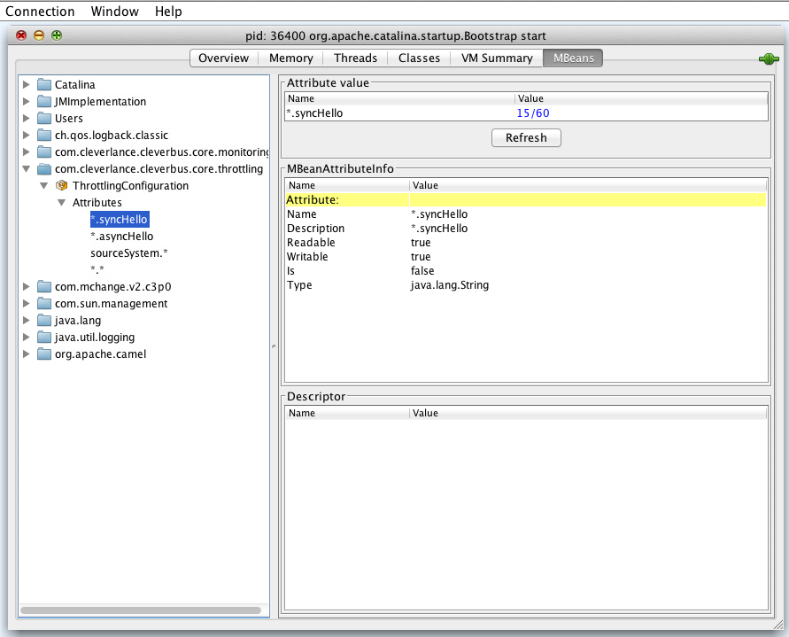

# throttling

    Since version 0.3

## Description

Component for [throttling](http://en.wikipedia.org/wiki/Throttling_process_(computing)) functionality. 

Throttling is functionality that checks count of input requests to integration platform and if this count exceeds defined limit then new requests are restricted.

Main goal of throttling is to limit disproportionate (and often wilful) overload of integration platform with huge amount of input requests for processing. This would have bad impact to application performance and even it can stop processing of current messages.

Throttling component counts input requests from specified source (external) system and for specific operation. If this count exceeds defined limit in defined time interval then CleverBus will start to reject new input requests (only requests from specified source system and for specified operation) - exception is thrown.

Throttling can be disabled at all by setting [*disable.throttling* parameter in *application.cfg*](../../User-guide/Configuration) to value *true*.

## Throttling configuration

Default configuration is in *throttlingCore.cfg* file placed in *core* module. Configuration file *throttling.properties* placed in *web-admin* module has higher priority and therefore parameters in this file can override parameters from *throttlingCore.cfg* file.

*throttlingCore.cfg* content:

```
throttling.defaultInterval = 60
throttling.defaultLimit = 60
```

Use the following parameters for throttling configuration:

-   ```throttling.defaultInterval```: default time interval in seconds. Default value is 60.
-   ```throttling.defaultLimit```: default max. count of requests for specified time interval. Default value is 60.
-   ```throttling.sourceSystem.operationName```, where
    -   *sourceSystem* identifies source (callee) system. Can be used specific system names (defined with *org.cleverbus.api.entity.ExternalSystemExtEnum*) or use asterisk (\*) that represents any source system. Then only requests with specific operations are checked. 
    -   *operationName* identifies operation. Can be also used asterisk (\*) that represents any operation. Then only requests from source systems are checked. 

Parameter *throttling.sourceSystem.operationName* has the format *limit[/interval]*:

-   *limit* specifies max. count of requests for specific combination source system vs. operation
-   *interval* specifies time interval (in seconds). If not defined then value from *throttling.defaultLimit* parameter is used.

### System level vs. operation level

Let's say we allow 30 messages per minute to flow through on system level, like this 

```
throttling.SAP = 30
```

for input, or 

```
throttling.out.SAP = 30
```

for output. If we're more restrictive on operation level output and allow only 20 messages calling operation *asyncOutage* per minute,

```
throttling.out.*.asyncOutage = 20
```

after calling operation *asyncOutage* 20 times through SAP system, this limitation will kick in first. If, on the other hand, we were to set this limit to 40 messages per minute,

```
throttling.out.*.asyncOutage = 40
```

messages would be stopped after 30th one.

Limiting  **only on operation level** will leave unincluded operations unhindered.

Limiting **only on system level** will take total number of operations going through that system.

### Examples:

- ```throttling.crm.op1 = 10``` (restriction to calls of operation *op1* from *CRM* system to 10 requests for 60 seconds)

- ```throttling.crm.* = 10/40``` (restriction to calls of any operation from *CRM* system to 10 requests for 40 seconds)

- ```throttling.*.sendSms = 60/30``` (restriction to calls of operation *sendSms* from any system to 60 requests for 30 seconds)

### Configuration via JMX

Throttling parameters is allowed to configured via JMX, for example with *jconsole* tool:



### URI format

```
throttling:requestType[:operationName]
```

## Options

| Parameter        | Description                         |
| ---------------- | ----------------------------------- |
| *requestType*    | Specifies request type<ul><li>*SYNC*: synchronnous request</li><li>*ASYNC*: asynchronnous request</li></ul><p>Throttling component for asynchronnous request is used in route *AsynchInMessageRoute* for processing all input asynch. requests.</p> |
| *operationName*  | operation name, e.g. "createCustomer" (mandatory for *SYNC* request type only) |

## Prerequisites

Throttling component needs reference to *org.cleverbus.spi.throttling.ThrottlingProcessor* that needs (in default implementation) reference to *org.cleverbus.spi.throttling.ThrottlingConfiguration* and *org.cleverbus.spi.throttling.ThrottleCounter*.

Common Spring configuration ([*sp\_camel\_services.xml*](../Maven-and-Spring)):

```xml
    <bean id="throttlingConfiguration" class="org.cleverbus.core.throttling.ThrottlingPropertiesConfiguration">
        <constructor-arg ref="confProperties"/>
        <property name="throttlingDisabled" value="${disable.throttling}"/>
    </bean>
    <bean class="org.cleverbus.core.throttling.ThrottleCounterMemoryImpl" />
    <bean class="org.cleverbus.core.throttling.ThrottleProcessorImpl" />
```

where *confProperties* is reference to *PropertiesFactoryBean* with throttling configuration file (*spring-ws-servlet.xml*).

```xml
    <bean id="confProperties" class="org.springframework.beans.factory.config.PropertiesFactoryBean">
        <property name="ignoreResourceNotFound" value="true"/>
        <property name="locations">
            <list>
                <value>classpath:applicationCore.cfg</value>
                ...
                <value>classpath:throttlingCore.cfg</value>
                <value>classpath:throttling.cfg</value>
                <value>classpath:throttling0.cfg</value>
            </list>
        </property>
    </bean>
```

## Example usage

```
throttling:sync:sendSms
throttling:async:
```

## Example implementations

Purpose of these two examples is to show how throttling component behaves in case of message overflow.

Request contains single parameter in its body - ``requestAmount``. Request is then duplicated and sent to throttling component this many times.

### Synchronous throttling example

Synchronous throttling example can be found in *org.cleverbus.modules.in.throttling.SyncThrottlingRoute*.

When request is received, it is unmarshaled (xml -> *SyncThrottlingRequest* class type), then goes through validation, which checks whether *requestAmount* parameter is within range of *0* and *SyncThrottlingRoute.REQUEST_AMOUNT_LIMIT*, then request is duplicated *requestAmount* of times and sent to ``throttling:sync:`` endpoint. After that response xml is formulated in *SyncThrottlingResponse* format.

Response contains original *requestAmount* if successful, *ValidationException* is thrown if request fails at validation, finally *ThrottlingExceededException* is thrown if throttling component limit is exceeded.

### Asynchronous throttling example

Asynchronous throttling example can be found in *org.cleverbus.modules.in.throttling.AsyncThrottlingRoute*.

Before request in unmarshaled, it goes through xpath validation to formulate synchronous callback response. This validation is same as with synchronous example, i.e. checks  whether *requestAmount* parameter is within range of *0* and *SyncThrottlingRoute.REQUEST_AMOUNT_LIMIT*. Caller then receives *OK* response on success or *FAIL* with
 respective exception (*AsyncThrottlingResponse* xml format). *ThrottlingExceededException* is **not** thrown during this phase.
 
On successful validation body is unmarshaled to *AsyncThrottlingRequest* class type, request is duplicated *requestAmount* of times and sent to ``throttling:async:`` endpoind. Success or failure of this operation is logged.

