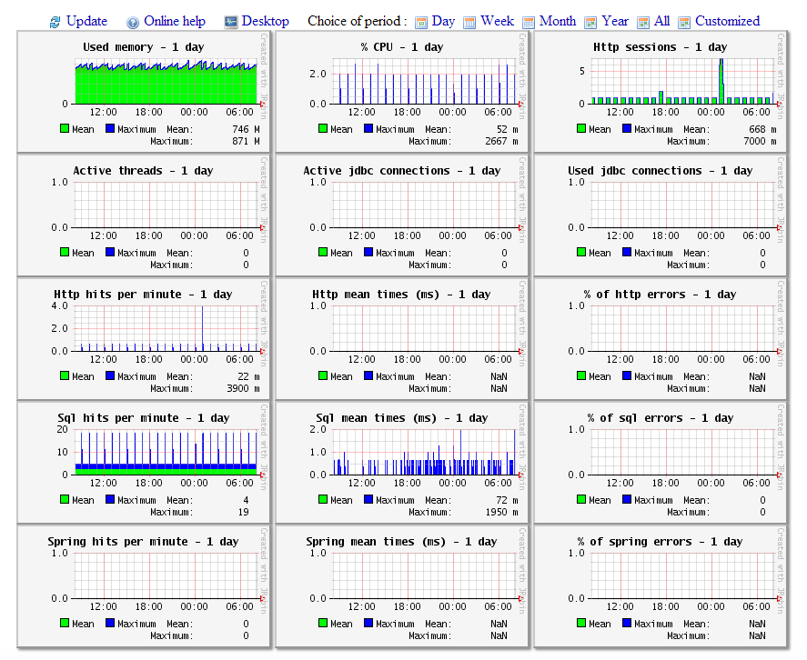

# JavaMelody

## Monitoring of CleverBus integration platform with JavaMelody

CleverBus as integration plaftorm provides tools to measure and calculate statistics on real operation of CleverBus depending on the usage of the application by users thanks to [JavaMelody](https://code.google.com/p/javamelody/) - tool to monitor Java or Java EE applications servers in QA and production environments.

It allows to improve applications in QA and production and helps to:

-   give facts about the average response times and number of executions
-   make decisions when trends are bad, before problems become too serious
-   optimize based on the more limiting response times
-   find the root causes of response times
-   verify the real improvement after optimizations

It includes summary charts showing the evolution over time of the following indicators:

-   Number of executions, mean execution times and percentage of errors of http requests, sql requests, jsf actions, struts actions, jsp pages or methods of business façades (if EJB3, Spring or Guice)
-   Java memory
-   Java CPU
-   Number of user sessions
-   Number of jdbc connections

These charts can be viewed on the current day, week, month, year or custom period.

By default javamelody is turn off. To enable you have to configure JAVA\_OPTS argument this way: **-Djavamelody.disabled=false**.

