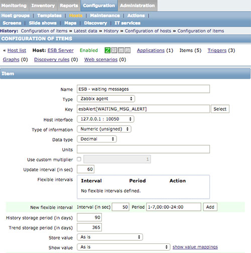
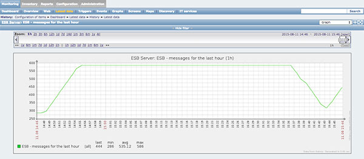

# CleverBus Alerts: Zabbix Integration

## Description

Cleverbus' [Alerts functionality](../Alerts) can be easily integrated with 3rd party monitoring tools via REST API. As an example, this article describes the integration with opensource monitoring and alerting tool [Zabbix](http://www.zabbix.org)

The integration with Zabbix can be realized using the "User parameters" functionality, available from the Zabbix 2.0+ ([https://www.zabbix.com/documentation/2.0/manual/config/items/userparameters](https://www.zabbix.com/documentation/2.0/manual/config/items/userparameters)):


- Prepare the script that will process the ESB alert data (returned in JSON format) and output the value that will be tracked by Zabbix. The following `getEsbAlert.py` Python script can be used for this (do not forget to set `<esb server>`, `<api user>` and `<api password>` parameters):

``` python
#!/usr/bin/python
import urllib2, json, sys

baseUrl = "https://<esb server>/esb/rpc/v1/alertCalculation/"
username = "<api user>"
password = "<api password>"

alert_key = sys.argv[1]
url = (baseUrl + "{}").format(alert_key)

password_mgr = urllib2.HTTPPasswordMgrWithDefaultRealm()
password_mgr.add_password(None, url, username, password)
handler = urllib2.HTTPBasicAuthHandler(password_mgr)
opener = urllib2.build_opener(handler)
response = opener.open(url)

data = json.load(response)
print data["count"]
```


- Add an user parameter definition to the Zabbix Agent configuration:

```
UserParameter=esbAlert[*],/usr/local/bin/getEsbAlert.py $1
```

- Create a new Zabbix item with key `esbAlert[<alert_id>]`:



- The resulting graph of values can be viewed at `Monitoring > Latest data > Graph`



- Basic e-mail alerts can be configured directly within Cleverbus (see [Alerts](../Alerts), more complex scenarios can be configured using Zabbix [Trigger functionality](https://www.zabbix.com/documentation/2.0/manual/config/triggers))
