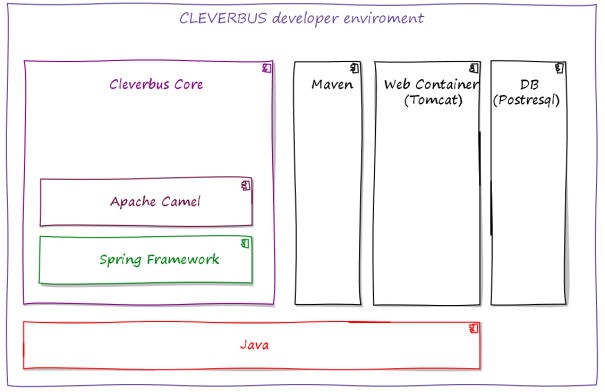

# Getting started

## What constitutes CleverBus

Following diagram descibes main technologies you came across when you start to develop with CleverBus. See [Architecture](../Architecture) section for more information.

## What a developer needs to know

Before you start playing with CleverBus you should have knowledge of the following frameworks and tools:

-   **Java JDK 1.6** (<http://docs.oracle.com/javase/6/docs/>)
-   **JAXB** (<http://docs.oracle.com/javase/6/docs/technotes/guides/xml/jaxb/index.html>, <https://jaxb.java.net/guide/> )
    -   basic concept
    -   XmlRootElement peculiarities
-   **JUnit** (<http://junit.org/> )
-   **Spring Framework** (<http://projects.spring.io/spring-framework/> )
    -   basic concept, XML configuration
    -   autowiring
    -   first-contract Spring-WS (<http://docs.spring.io/spring-ws/site/reference/html/tutorial.html> )
-   **Apache Maven** (<http://maven.apache.org/> )
    -   basic concept
    -   profiles (<http://maven.apache.org/pom.html#Profiles> )
-   **Apache Camel** (<http://camel.apache.org/> )
    -   Basic concept
    -   JavaDSL style (<http://camel.apache.org/java-dsl.html> )
    -   Methods mostly used in CleverBus routes
        -   from, to, routeId, id, log
        -   unmarshal, marshal, jaxb, convertBodyTo, transform, validate, split, filter, method
        -   simple, mvel, constant
        -   loop, choice, when, otherwise, end, endChoice
        -   doTry, doCatch, onException, continued, handled, throwException
        -   process, pipeline, routingSlip
        -   multicast, stopOnException
        -   setProperty, setHeader, removeHeader, setBody, header, append
        -   bean, beanRef
        -   exchange: getIn, getOut
-   **SoapUI** (<http://www.soapui.org/> )

## What a developer needs to install

### Necessary

-   **Java JDK 6** (<http://www.oracle.com/technetwork/java/javasebusiness/downloads/java-archive-downloads-javase6-419409.html> )
-   **Apache Maven** **3** (<http://maven.apache.org/download.cgi> )
-   **JAVA IDE**
    -   Eclipse IDE for Java EE Developers (<https://www.eclipse.org/downloads> )
    -   Spring Tool Suite ( <http://spring.io/tools/sts> )
    -   IntelliJ IDEA (<http://www.jetbrains.com/idea/download/> )
-   *all other needed libraries are fetched by Maven*

### Optional

-   **Apache Tomcat** (<http://tomcat.apache.org/> ) – in fact, during developing you can run your routes just in JUnit test. However for integration test you will need deploy application with routes on Tomcat.
-   **PostgreSQL** (<http://www.postgresql.org/download/> ) – for JUnit tests run, H2 DB is used by default; for Tomcat deployment, PostreSQL db datasource is used
-   **SoapUI** (<http://www.soapui.org/>)

