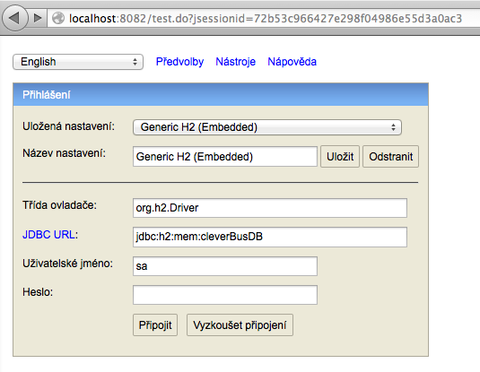
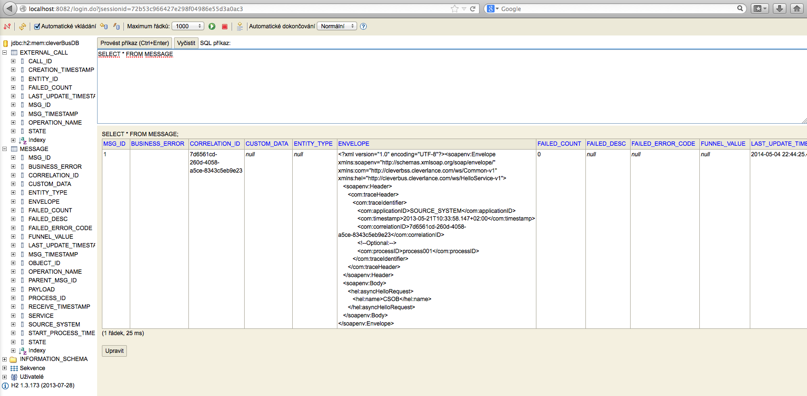
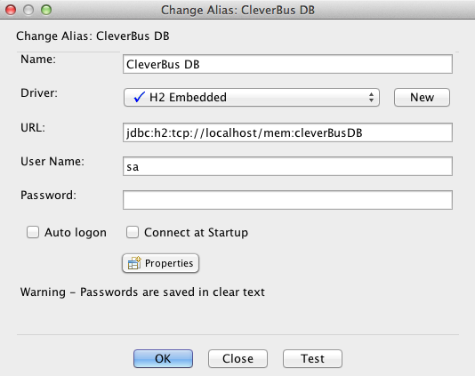

# H2 database

## Description

Default database (mainly for development and testing purposes) is [H2 database](http://www.h2database.com).

H2 database is running in embedded (local)[in-memory mode](http://www.h2database.com/html/features.html#in_memory_databases) with database name *cleverBusDB*.

```java
db.driver=org.h2.Driver
db.url=jdbc:h2:mem:cleverBusDB
db.username=sa
db.password=
```

If there's need to see records in in-memory database during CleverBus running then there are the following possibilites.

## H2 console

[H2 console](http://www.h2database.com/html/tutorial.html#tutorial_starting_h2_console) is web browser based application that is configured on 8082 port.

### configuration in sp\_dataSources.xml

``` xml
<bean id="h2WebServer" class="org.h2.tools.Server"factory-method="createWebServer" init-method="start" destroy-method="stop">
	<constructor-arg value="-web,-webAllowOthers,-webPort,8082"/>
</bean>
```

### Login page



### Select messages



## JDBC via TCP

It's possible to connect H2 CleverBus in-memory DB if H2 server is configured.

### configuration in sp\_dataSources.xml

``` xml
<bean id="h2Server" class="org.h2.tools.Server" factory-method="createTcpServer" init-method="start"
destroy-method="stop" depends-on="h2WebServer">
	<constructor-arg value="-tcp,-tcpAllowOthers,-tcpPort,9092"/>
</bean>
```

### Login in Squirell:



