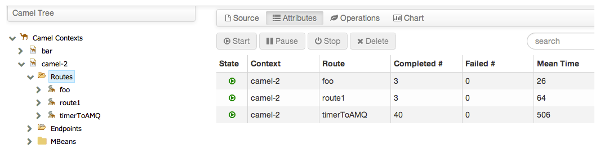
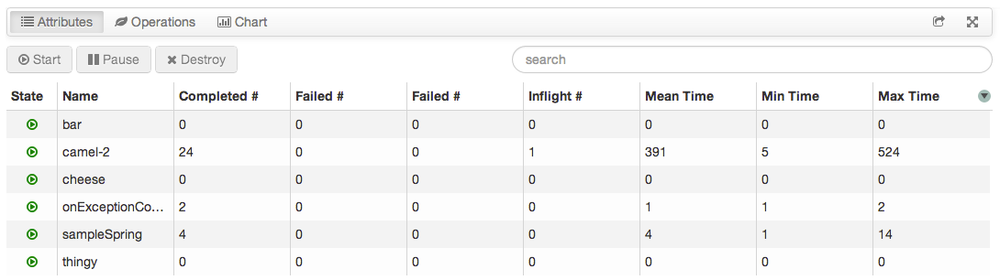
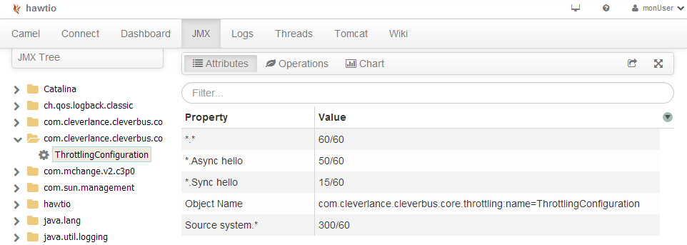
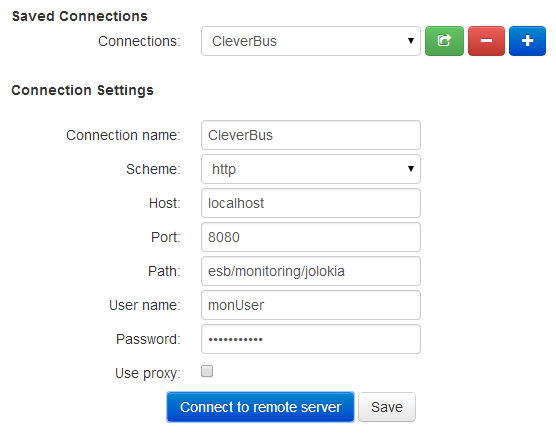

# Hawtio

## Monitoring of Apache Camel with hawtio

The core of CleverBus integration platform is Apache Camel framework To monitor Apache Camel CleverBus provides a lightweight and modular HTML5 web console [hawtio](http://hawt.io/) tool. Lets you browse CamelContexts, routes, endpoints. Visualise running routes and their metrics. Create endpoints. Send messages. Trace message flows, as well profile routes to identifiy which parts runs fast or slow.

You can view all the running Camel applications in the current JVM. You can among others see the following details:

-   Lists of all running Camel applications
-   Detailed information of each Camel Context such as Camel version number, runtime statics
-   Lists of all routes in each Camel applications and their runtime statistics
-   Manage the lifecycle of all Camel applications and their routes, so you can restart / stop / pause / resume, etc.
-   Graphical representation of the running routes along with real time metrics
-   Live tracing and debugging of running routes
-   Profile the running routes with real time runtime statics; detailed specified per processor
-   Browsing and sending messages to Camel endpoint

You can also configure JMX properties, for example for Throttling Configuration:

**Hawtio** web console communicates with application by a [jolokia agent](http://jolokia.org/). Jolokia is a JMX-HTTP bridge giving an alternative to JSR-160 connectors. It is an agent based approach with support for many platforms. In addition to basic JMX operations it enhances JMX remoting with unique features like bulk requests and fine grained security policies. There are many ways to use console such as using executable jar, deployable WAR and others. For details see [official site](http://hawt.io/getstarted/index.html).

The jolokia agent as servlets is listening on **/monitoring/jolokia/\*** context and by default with *monUser/monPassword* credentials. For remote connection it's necessary to configure hawtio console such as below:

