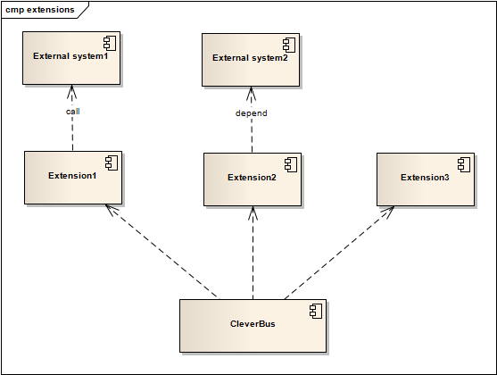

# How to implement new extensions

When you want to create new extension then follow these steps:

### 1) locate CleverBus extensions project

See [Development info](Development) for more details.

### 2) create new module

-   create new Maven module for new extension (pom.xml, README.txt)
-   create new packages which start by *org.cleverbus.extension.[extension name]*

### 3) create extension configuration

Each extension must have Spring XML configuration file that completelly initializes specific extension.

-   /META-INF/sp\_ext\_[ext\_name].xml - this configuration most often loads property files and initializes routes.
-   ext\_[ext\_name].cfg - file with configuration parameters

Each extension is initialized in independent Spring context, see <a href='Dynamic-extension-loading'>dynamic extension loading</a> for more details.

### 4) implement routes

Use parent class *org.cleverbus.api.route.AbstractExtRoute* for imlementation of extension routes.

If there are specific error codes then implement *ErrorExtEnum *with your codes.

Enumeration of external systems (*ExternalSystemExtEnum*) or enumeration of services (*ServiceExtensionEnum*) is in *common* module of CleverBus extension project. 

Each extension can have own XSD/WSDL resources for converting to Java - use *jaxb\_global\_bindings.xjb* file from *common* module. See MVCR module for more details.

### 5) unit tests and wiki

Don't forget to implement unit tests and write comprehensive info about extension to wiki. Add new page under [CleverBus extensions](CleverBus-extensions) page.

