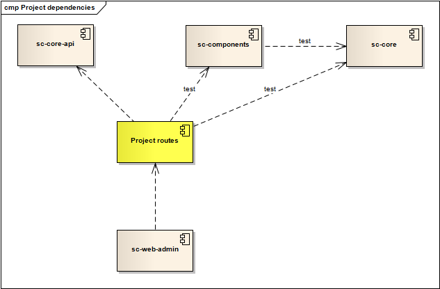

# How to start new project?

If you want to start to implement new integration project (implement new routes) then you have the following options:

### 1) implement new routes in separate project and use it with CleverBus

This approach supposes to use CleverBus admin as is (without any additional changes) with adding dependencies to external projects/libraries with route implementations. This approach is very similar how works [CleverBus extensions](CleverBus-extensions), specifically look at [How to implement new extensions](-implement-new-extensions).

There is one big difference between extensions and adding Project routes to CleverBus - extensions are initialized in own Spring child context but when you add external project routes then you use same Spring context like other routes implemented directly in CleverBus.



This approach has several steps:

-   create separated project for route implementations with dependency to CleverBus API ([*core-api* module](Maven-and-Spring))
-   add dependency to project's artefact (JAR file is expected)
-   adjust Spring configuration to initialize Project routes (all in *web-admin module*)
    -   add Spring XML configuration file (*/src/main/webapp/WEB-INF/spring-ws-servlet.xml*)
    -   add property files (*/src/main/webapp/WEB-INF/spring-ws-servlet.xml*)
    -   extend Spring auto-scaning

You can use [Dynamic extension loading](Dynamic-extension-loading) functionality even if you don't implement extensions, you can use extension/external library concept for initialization.

Use *extensions.cfg* (or *extensions0.cfg*) and add parameter for external library.

This approach has advantage that it's not necessary to make changes in CleverBus at all (only set extension properties)

### 2) create new project from CleverBus web-admin

CleverBus *web-admin* module contains admin GUI and all necessary configurations for runnable and deployable CleverBus web application.

Create new (Maven) project with the following module structure:

-   project routes implementation (analogy to *examples* module, see [Maven and Spring](Maven-and-Spring))
-   web admin with dependency to previous module with routes. This module is analogy to *web-admin* module in CleverBus. 

The most simple approach is to copy *web-admin* module from CleverBus and adjusts it for new project. There are the following steps to do:

-   change Maven dependencies (*pom.xml*)
-   change package names for auto-scanning of route implementations (*/src/main/webapp/WEB-INF/spring-ws-servlet.xml*)
-   if needed change security settings (*/src/main/webapp/WEB-INF/rootSecurity.xml*)

If you want to customize web admin (add new content or change look-at-feel or whatever else) then there are two ways how to do it:

-   use or copy/duplicate default [Admin GUI](Admin-GUI) from CleverBus to your project and make changes. This approach has one big disadvantage that it will be tricky to upgrade Admin GUI to newer versions.
-   second possibility is to leave Admin GUI as is (without changes) and create new web content in separated web context or web application. In other words decouple Admin GUI content from your web content.

If you use different database to [default H2 DB](H2-database) then you must initialize database structure with SQL scripts for specific target databases, e.g. */db/db\_schema\_postgreSql.sql* (*core* module) for PostgreSQL.

### 3) use Maven archetype

Use [Maven archetypes](http://maven.apache.org/guides/introduction/introduction-to-archetypes.html) for creating new project based on CleverBus. Maven archetype is implemented in *web-admin-archetype*.

Build customized project from archetype *cleverbus-web-admin-archetype* it **is possible by command**:

```
    mvn archetype:generate
       -DarchetypeCatalog=(local|remote)
       -DarchetypeGroupId=org.cleverbus
       -DarchetypeArtifactId=cleverbus-web-admin-archetype
       -DarchetypeVersion=<version>
       -DcleverBusVersion=<version>
       -DcleverBusServerName=ESB
       -DcleverBusServerDescription="Enterprise Service Bus"
```

*Note: one of the best practices is that the name of package ends on ".admin", because archetype contains only admin console, all other is as dependency.*


