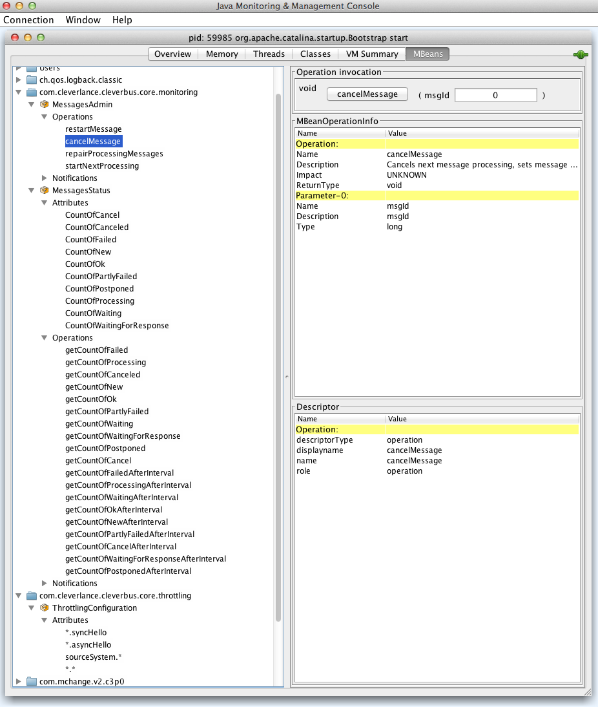

# JMX

## Description

JMX (Java Management Extension) allows to monitor statistics about asynchronnous messages or starts administration operations.

## JVM and Camel attributes

See [Camel JMX](http://camel.apache.org/camel-jmx.html) for more info about Camel attributes and operations - "By default, JMX instrumentation agent is enabled in Camel, which means that Camel runtime creates and registers MBean management objects with a `MBeanServer` instance in the VM. This allows Camel users to instantly obtain insights into how Camel routes perform down to the individual processor level. The supported types of management objects are [endpoint](http://camel.apache.org/maven/current/camel-core/apidocs/org/apache/camel/management/mbean/ManagedEndpoint.html), [route](http://camel.apache.org/maven/current/camel-core/apidocs/org/apache/camel/management/mbean/ManagedRoute.html), [service](http://camel.apache.org/maven/current/camel-core/apidocs/org/apache/camel/management/mbean/ManagedService.html), and [processor](http://camel.apache.org/maven/current/camel-core/apidocs/org/apache/camel/management/mbean/ManagedProcessor.html)."

| Parameter | Description | Note  |
| ----------| ----------- | ----- |
| Current heap size | Current heap memory size. | If there is no enough memory then garbage collector needs more often to free memory and the performance is suffering. |
| Maximum heap size | Maximum heap memory size. | Related to the previous parameter. |
| Live threads | Current count of running threads | If there is trend with increasing number of threads then it seems to be a problem. |
| Apache Camel parametry - *org.apache.camel* | Running statistics from Apache Camel |  |

## MessageStatus - statistics about asynchronnous messages

| Parameter                                  | Description                                                   |
|------------------------------------------- | ------------------------------------------------------------- |
| *countOfFailed*                            | Count of messages in state FAILED                             |
| *countOfProcessing*                        | Count of messages in state PROCESSING                         |
| *countOfCanceled*                          | Count of messages in state CANCEL                             |
| *countOfNew*                               | Count of messages in state NEW                                |
| *countOfOk*                                | Count of messages in state OK                                 |
| *countOfPartlyFailed*                      | Count of messages in state PARTLY_FAILED                      |
| *countOfWaiting*                           | Count of messages in state WAITING                            |
| *countOfWaitingForRespons*                 | Count of messages in state WAITING_FOR_RES                    |
| *countOfPostponed*                         | Count of messages in state POSTPONED                          |
| *countOfCancel*                            | Count of messages in state CANCEL                             |
| *countOfFailedAfterInterval*               | Count of messages in state FAILED and after interval          |
| *countOfProcessingAfterInterval*           | Count of messages in state PROCESSING and after interval      |
| *countOfWaitingAfterInterval*              | Count of messages in state WAITING and after interval         |
| *countOfOkAfterInterval*                   | Count of messages in state OK and after interval              |
| *countOfNewAfterInterval*                  | Count of messages in state NEW and after interval             |
| *countOfPartlyFailedAfterInterval*         | Count of messages in state PARTLY_FAILED and after interval   |
| *countOfCancelAfterInterval*               | Count of messages in state CANCEL and after interval          |
| *countOfWaitingForResponseAfterInterval*   | Count of messages in state WAITING_FOR_RES and after interval |
| *countOfPostponedAfterInterval*            | Count of messages in state POSTPONED and after interval       |

## MessageAdmin - message administration

Since 0.2 version

### *restartMessage*

Restarts message for next processing.

*totalRestart* parameter determines if message should start from scratch again (*true*) or if message should continue when it failed (*false*).

 
### *cancelMessage*

Cancels next message processing, sets message to CANCEL state.
 
### *startNextProcessing*

Starts next processing of PARTLY\_FAILED and POSTPONED messages.
Can run one process at one time only.

### *repairProcessingMessages*

Starts repairing processing messages.
 
