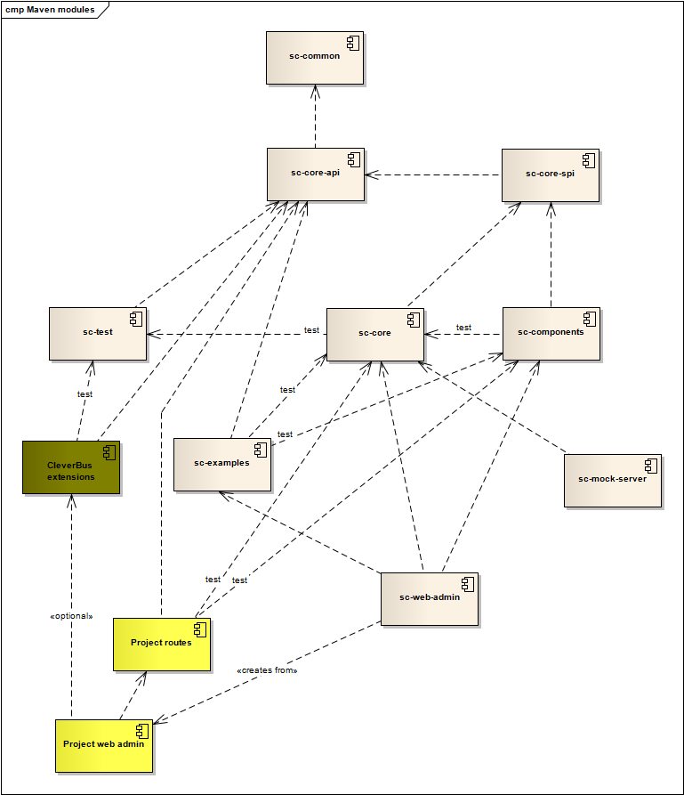
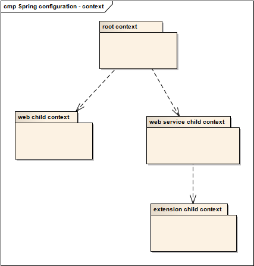
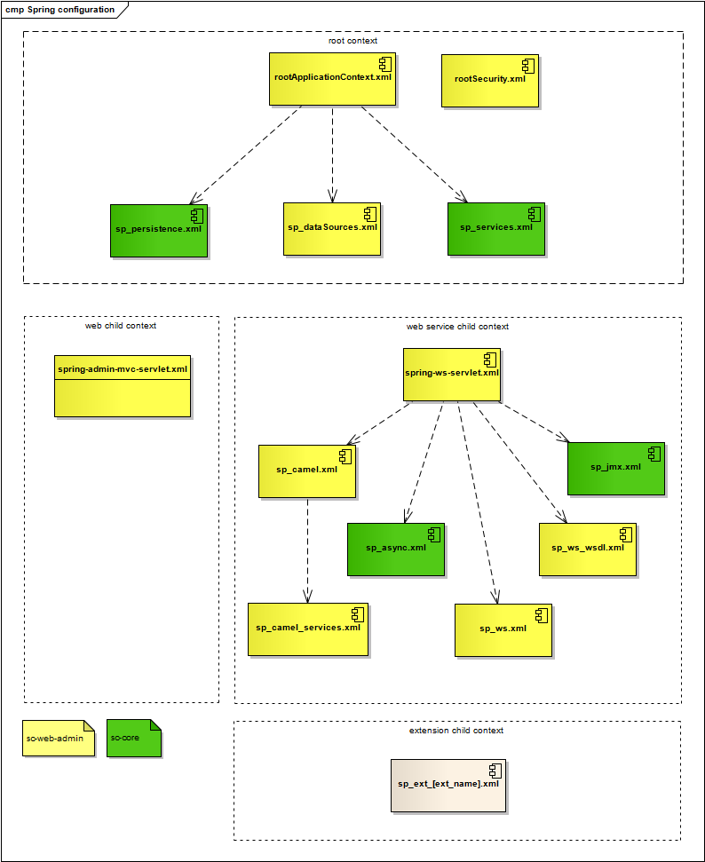
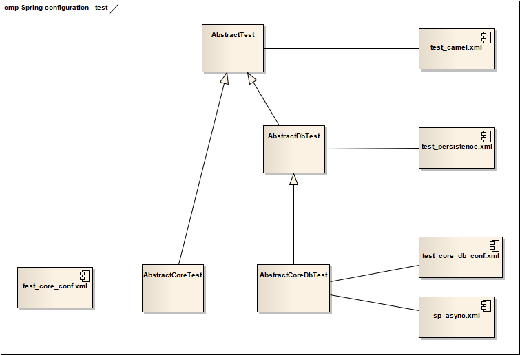

# Maven and Spring

## Maven modules

``` xml
<groupId>org.cleverbus</groupId>
<artifactId>cleverbus-integration</artifactId>
```

CleverBus framework consists of the following Maven modules:

-   **common**: module contains useful functions for other modules
-   **core-api**: user API for writing new routes with CleverBus
-   **core-spi**: interface for internal use in CleverBus components
-   **core**: basic implementation module
-   **test**: module with basic configuration and parent classes for tests
-   **components**: CleverBus components
-   **examples**: examples how to use CleverBus
-   **web-admin**: [admin GUI](Admin-GUI) web application
-   **web-admin-archetype**: [Maven archetype](http://maven.apache.org/guides/introduction/introduction-to-archetypes.html) for easy creation of new CleverBus project



``` xml
            <dependency>
                <groupId>org.cleverbus</groupId>
                <artifactId>cleverbus-common</artifactId>
                <version>${project.version}</version>
            </dependency>
            <dependency>
                <groupId>org.cleverbus</groupId>
                <artifactId>cleverbus-core-api</artifactId>
                <version>${project.version}</version>
            </dependency>
            <dependency>
                <groupId>org.cleverbus</groupId>
                <artifactId>cleverbus-core-spi</artifactId>
                <version>${project.version}</version>
            </dependency>
            <dependency>
                <groupId>org.cleverbus</groupId>
                <artifactId>cleverbus-core</artifactId>
                <version>${project.version}</version>
            </dependency>
            <dependency>
                <groupId>org.cleverbus</groupId>
                <artifactId>cleverbus-components</artifactId>
                <version>${project.version}</version>
            </dependency>
            <dependency>
                <groupId>org.cleverbus</groupId>
                <artifactId>cleverbus-test</artifactId>
                <version>${project.version}</version>
            </dependency>
            <dependency>
                <groupId>org.cleverbus</groupId>
                <artifactId>cleverbus-examples</artifactId>
                <version>${project.version}</version>
            </dependency>
```

There were the following names before 1.1 version:<ul><li>groupId: <i>com.cleverlance.cleverbus</i></li><li>artifactIds start with <i>sc-</i> prefix</li></ul>

CleverBus depends on several Camel components and if you want to use another Camel component with same Camel's version then you can do it:

1.  import dependencies from CleverBus

    ``` xml
    <dependency>
     <groupId>org.cleverbus</groupId>
     <artifactId>cleverbus-integration</artifactId>
     <version>${cleverBus-version}</version>
     <scope>import</scope>
     <type>pom</type>
    </dependency>
    ```

2.  use specific component which you want

    ``` xml
    <dependency>
     <groupId>org.apache.camel</groupId>
     <artifactId>camel-crypto</artifactId>
    </dependency>
    ```

    Since version 1.1

 

## Spring contexts

CleverBus uses and is configured by [Spring framework](http://projects.spring.io/spring-framework/).

There are the following **Spring contexts hierarchy** from the web application (=admin GUI) point of view:

-   **root application context**; Apache Camel, database and security ([Spring security](http://projects.spring.io/spring-security/)) is initialized in this context
-   **spring-ws**: Spring Web Services context
-   **spring-admin-mvc**: Spring Web MVC context





## Spring profiles

CleverBus framework uses **Spring profiles to simplify configuration for different target environments:**

-   **dev (default)**: profile for development environment; this profile has disabled several functions which are enabled in production, e.g. scheduled tasks for asynchronous messages
-   **prod**: profile for testing and production environment

Next Spring profiles are used for switching between databases (more in configuration file *META-INF/sp\_dataSources.xml*)

-   **h2 (default):** database [H2](http://www.h2database.com) in embedded in-memory mode, more information in chapter about [H2 database](H2-database)
-   **postgreSql**: profile for [PostgreSQL](http://www.postgresql.org) database

Defaults Spring profiles are set in* web.xml*, it's possible to override them by system parameter *spring.profiles.active*:

``` xml
    <context-param>
        <param-name>spring.profiles.default</param-name>
        <param-value>dev,h2</param-value>
    </context-param>
```

## Spring configuration for tests



## Maven profiles

There are also **Maven profiles** which correspond to Spring profiles. Maven profiles solve dependency to third-party libraries for specific target environment and settings of folders, logs etc. See *pom.xml* in module *sc-web-admin.*

-   **esb.dev**
-   **esb.prod**
-   **esb.psSqlb** - profile for PostgreSQL database
-   **esb.psSql.prod** - profile for PostgreSQL database but PostgreSQL libraries are *"provided"*
 

CleverBus compilation with Maven for local use (=dev) with PostgreSQL database:

``` 
mvn clean && mvn -DskipTests -Pesb.psSql package
```

Application server starts with the following system parameter *spring.profiles.active*:

```
postgreSql,dev
```

