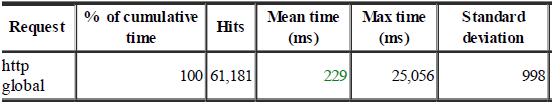
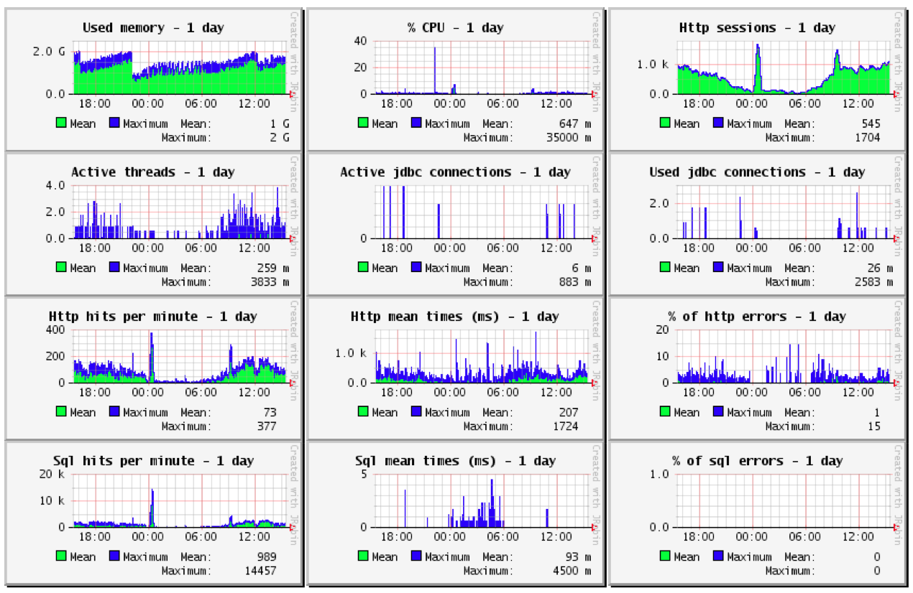
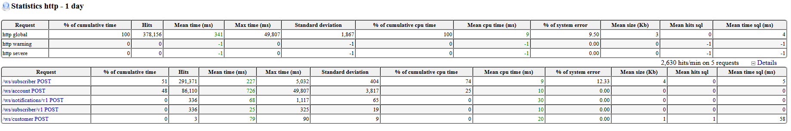
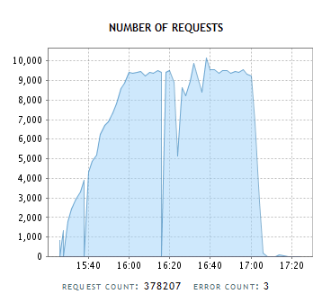
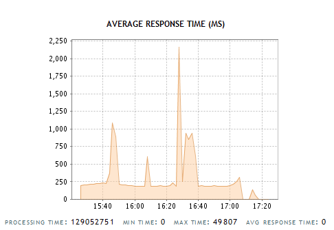
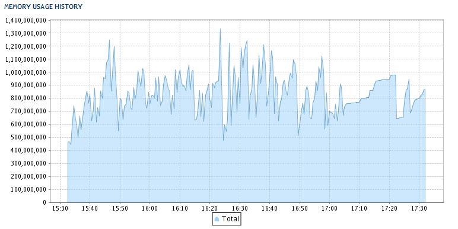
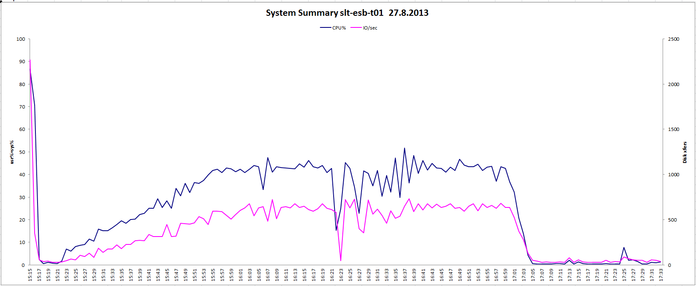

# SazkaMobil performance

## Performance statistics from production

### Hardware

Server infrastructure is composed of blade server Cisco UCS B200 with chassis Cisco 5108, Intel xeon 4CPU + 8GB RAM + 96GB HDD. We need more memory and space on filesystem because there are two other running applications on the same server.

### Request count (12.9.2014)

Request average processing time is to 1 second.

### Report from JavaMelody

Memory usage - current state (on average 1GB from overall 8GB)

## Performance test reports from test environment

### Test 1

Overall count of requests during 10.9.2014: **91611**

Asynchronous requests from overall count: **78576** (**607** in state *FAILED*)

Average processing time of asynchronous message (*last\_update\_timestamp* - *receive\_timestamp*): **0,003941**

Average response time during the whole day: **470ms**, min is not measured, max 02s 31,000ms

Request sizes:

-   *createOrderExt* (order creation) – cca 2,89KB
-   *createTopUpExt* (charging) - 1,36 KB
-   *updateSubscriberAssignedProducts* - 1,44 KB
-   *getSubscriber* - 276 bytes

**Average size is 0,3KB, max. size is 3KB.**

### Test 2

-   load was **56** http requests / second
-   overall count of requests: **378207** 
-   average response time was 250ms, 2s during stress test because of external systems
-   memory was not higher than 1,3GB

#### Hardware

|             | **Proxy** | **Selfcare** | **ESB**    | **Billing** | 
| ------------| --------- | ------------ | ---------- | ----------- |
| *\# Cores*  | 2         | 8            | **2**      | 10          |
|*RAM [GB]*   | 3         | 10           | **3**      | 64          |

#### System

|                    | **Proxy** | **Selfcare** | **ESB**    | **Billing** | 
| ------------------ | --------- | ------------ | ---------- | ----------- |
| CPU %              | 7         | 8            | **43**     | 8           |
| I/O disk xfers     | 38        | 650          | **600**    | 38          |
| Disk Read KB/s     | 20        | 0            | **500**    | 10          |
| Disk Write KB/s    | 350       | 5000         | **6500**   | 380         |
| IO/s               | 35        | 650          | **580**    | 38          |
| Net I/O in MB/s    | 2,8       | 0,7          | **1,3**    | 2,5         |
| Net I/O out MB/s   | 2,8       | 0,5          | **1,4**    | 2,8         |
| pgpgin MB/s        | 0,5       | 0            | **10**     | 0,3         |
| pgpgout MB/s       | 7         | 100          | **130**    | 7           |
| pswpin MB/s        | 0         | 0            | **0,6**    | 0           |
| pswpout MB/s       | 0         | 0            | **0,7**    | 0           |

#### Apache

|                    | **Proxy** | **ESB**    |
| ------------------ | --------- | ---------- |
| Total Accesses     | 345415    | **364918** | 	
| Total Traffic [GB] | 1,1       | **2,1**    |          
| requests/s         | 56,6      | **60,6**   |
| kB/second          | 193       | **372**    | 

#### JVM

|                    | **ESB**    | **Billing** | 
| ------------------ | ------------ | ---------- |
| Sessions avg       | 4500         | **30**     |   
| Requests total     | 363551       | **392980** |             |
| Requests avg       | 9000         | **10000**  |             |
| Avg Response [ms]  | 60           | **40**     |             |
| Heap avg [GB]      | 1            | **1**      |             |

